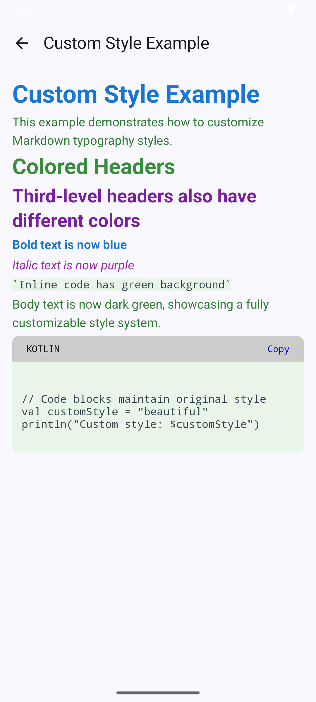
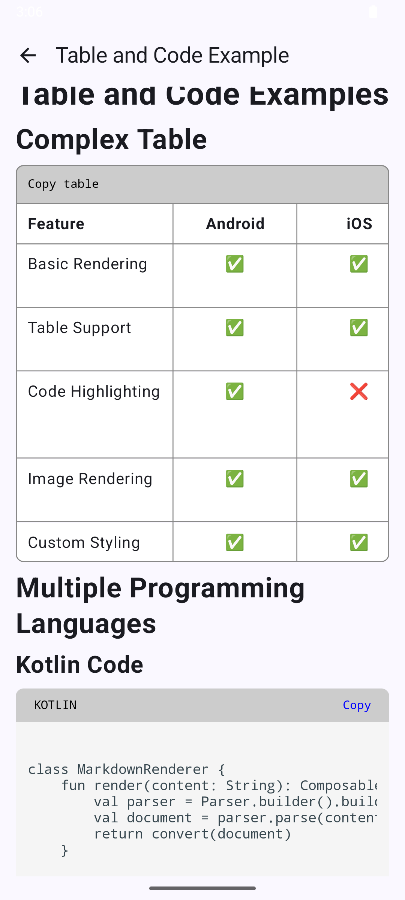
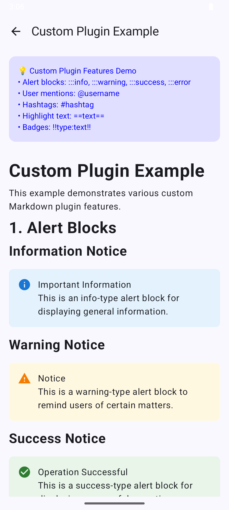

# Compose Markdown

[English](README.md) | [简体中文](README_zh-CN.md)

A powerful and highly customizable Jetpack Compose Markdown rendering library that supports rich
Markdown syntax and custom styling.

## Table of Contents

- [Features](#-features)
- [Tech Stack](#-tech-stack)
- [Installation](#-installation)
- [Quick Start](#-quick-start)
- [Core Components](#-core-components)
- [Style Customization](#-style-customization)
- [Advanced Features](#-advanced-features)
- [Plugins](#-plugins)
- [API Overview](#-api-overview)
- [FAQ](#-faq)
- [Contributing](#-contributing)
- [License](#-license)

## 📋 Features

### 📸 Sample Screenshots

| Custom Styles | Tables and Code Blocks |             Custom Plugins (Alerts)             |
| :---: | :---: |:-----------------------------------------------:|
| *Custom typography styles* | *Complex tables and code highlighting* |                 *Custom block*                  |
|  |  |  |

### Core Features

- ✅ **Standard Markdown Support** - Full support for CommonMark specification
- ✅ **Extended Syntax** - Support for GFM (GitHub Flavored Markdown) tables
- ✅ **Code Syntax Highlighting** - Multi-language code block syntax highlighting
- ✅ **Multimedia Support** - Rendering of images, links and other multimedia content
- ✅ **Responsive Design** - Perfect adaptation to different screen sizes

### Performance & Extensions

- ⚡ **Async Parsing** - Background thread parsing ensures UI fluidity
- 🎨 **Fully Customizable** - Support for custom styles, renderers and parsers
- 🔌 **Plugin System** - Flexible plugin architecture for feature extensions
- 🛡️ **Error Handling** - Graceful error state handling mechanism

## 🔧 Tech Stack

| Technology            | Version     | Purpose                       |
|-----------------------|-------------|-------------------------------|
| **Jetpack Compose**   | 2025.12.00+ | Modern UI framework           |
| **Flexmark**          | 0.64.8      | Markdown parsing engine       |
| **Kotlin Coroutines** | 1.7+        | Asynchronous processing       |
| **Material Design 3** | Latest      | Design language specification |

## 📦 Installation

### System Requirements

- **Android API**: 24+ (Android 7.0)
- **Kotlin**: 2.0.21+
- **Compose BOM**: 2025.12.00+
- **Java**: 8+

### Add Dependency

1. Add `jitpack.io` repository to your project:

```kotlin
repositories {
    ...
    maven(url = "https://jitpack.io")
}
```

2. Add the dependency to your project's `build.gradle.kts` :
   define library module in your `./gradle/libs.versions.toml` file:

```toml
[versions]
compose-markdown = "0.0.1"
composeBom = "2025.12.00"
coil = "2.5.0"
[libraries]
androidx-compose-bom = { group = "androidx.compose", name = "compose-bom", version.ref = "composeBom" }
coil-compose = { group = "io.coil-kt", name = "coil-compose", version.ref = "coil" }
compose-markdown = { group = "com.github.feiyin0719", name = "ComposeMarkdown", version.ref = "compose-markdown" }
```

add the dependency in your module `build.gradle.kts`:

```kotlin
dependencies {
    implementation(libs.androidx.core.ktx)
    implementation(platform(libs.androidx.compose.bom))
    implementation(libs.androidx.ui)
    implementation(libs.androidx.ui.graphics)
    implementation(libs.androidx.ui.tooling.preview)
    implementation(libs.androidx.material3)
    implementation(libs.coil.compose)
    implementation(libs.compose.markdown)
}
```

## 🚀 Quick Start

### Basic Usage

The simplest way to use:

```kotlin
import com.iffly.compose.markdown.MarkdownView
import com.iffly.compose.markdown.config.MarkdownRenderConfig

@Composable
fun SimpleMarkdownExample() {
    val markdownContent = """
        # Welcome to Compose Markdown
        
        This is a powerful Markdown rendering library.
        
        ## Supported Features
        
        - **Bold text**
        - *Italic text*
        - `Inline code`
        - [Link](https://github.com)
        
        ### Code Block Example
        
        ```kotlin
        @Composable
        fun HelloWorld() {
            Text("Hello, Compose Markdown!")
        }
        ```
    """.trimIndent()

    val config = remember { MarkdownRenderConfig.Builder().build() }

    MarkdownView(
        content = markdownContent,
        markdownRenderConfig = config,
        modifier = Modifier.fillMaxSize(),
    )
}
```

### Usage with Configuration (MarkdownTheme)

```kotlin
import com.iffly.compose.markdown.style.MarkdownTheme

@Composable
fun ConfiguredMarkdownExample() {
    val markdownTheme =
        MarkdownTheme(
            textStyle =
                TextStyle(
                    fontSize = 16.sp,
                    lineHeight = 24.sp,
                ),
            headStyle =
                mapOf(
                    1 to TextStyle(fontSize = 28.sp, fontWeight = FontWeight.Bold),
                    2 to TextStyle(fontSize = 24.sp, fontWeight = FontWeight.Bold),
                ),
        )

    val config =
        remember {
            MarkdownRenderConfig.Builder()
                .markdownTheme(markdownTheme)
                .build()
        }

    MarkdownView(
        content = "# Custom Style Title\n\nThis is Markdown content with custom styling.",
        markdownRenderConfig = config,
        modifier = Modifier.fillMaxSize(),
        showNotSupportedText = true,
        actionHandler = ActionHandler { action ->
            // Handle actions (links, images, etc.)
        },
        onError = { error ->
            Text(
                text = "Content parsing failed: ${error.message}",
                color = MaterialTheme.colorScheme.error,
            )
        },
    )
}
```

### MarkdownRenderConfig (overview)

High-level configuration for markdown rendering, created via:

```kotlin
val config = MarkdownRenderConfig.Builder()
    .markdownTheme(MarkdownTheme())
    // .addPlugin(...)
    // .addBlockRenderer(...)
    // .addInlineNodeStringBuilder(...)
    .build()
```

For full configuration API, see [docs/API.md](docs/API.md).

## 🎨 Style Customization (MarkdownTheme)

`MarkdownTheme` describes typography, colors and component styles for markdown content.

### Basic Style Configuration

```kotlin
val markdownTheme =
    MarkdownTheme(
        textStyle =
            TextStyle(
                fontSize = 16.sp,
                lineHeight = 24.sp,
                fontFamily = FontFamily.Default,
            ),
        strongEmphasis =
            SpanStyle(
                fontWeight = FontWeight.Bold,
                color = MaterialTheme.colorScheme.primary,
            ),
        emphasis =
            SpanStyle(
                fontStyle = FontStyle.Italic,
                color = MaterialTheme.colorScheme.onSurface.copy(alpha = 0.8f),
            ),
        code =
            TextStyle(
                fontFamily = FontFamily.Monospace,
                fontSize = 14.sp,
                color = MaterialTheme.colorScheme.secondary,
                background = MaterialTheme.colorScheme.surfaceVariant,
            ),
        link =
            TextLinkStyles(
                style =
                    SpanStyle(
                        color = MaterialTheme.colorScheme.primary,
                        textDecoration = TextDecoration.Underline,
                    ),
                hoveredStyle =
                    SpanStyle(
                        color =
                            MaterialTheme.colorScheme.primary.copy(
                                alpha = 0.8f,
                            ),
                        textDecoration = TextDecoration.Underline,
                    ),
                pressedStyle =
                    SpanStyle(
                        color =
                            MaterialTheme.colorScheme.primary.copy(
                                alpha = 0.6f,
                            ),
                        textDecoration = TextDecoration.Underline,
                    ),
            ),
    )
```

### Heading Style Customization

```kotlin
val markdownTheme =
    MarkdownTheme(
        headStyle =
            mapOf(
                MarkdownTheme.HEAD1 to
                    TextStyle(
                        fontSize = 32.sp,
                        fontWeight = FontWeight.Bold,
                        color = MaterialTheme.colorScheme.primary,
                    ),
                MarkdownTheme.HEAD2 to
                    TextStyle(
                        fontSize = 28.sp,
                        fontWeight = FontWeight.Bold,
                        color = MaterialTheme.colorScheme.onSurface,
                    ),
                MarkdownTheme.HEAD3 to
                    TextStyle(
                        fontSize = 24.sp,
                        fontWeight = FontWeight.SemiBold,
                        color = MaterialTheme.colorScheme.onSurface,
                    ),
            ),
    )
```

You can pass this theme into `MarkdownRenderConfig.Builder().markdownTheme(markdownTheme)`.

## 🔧 Advanced Features

### MarkdownView Usage Modes (updated API)

MarkdownView provides multiple usage modes to adapt to different use cases.

#### 1. Synchronous Parsing Version (Instant Parsing)

Suitable for small content that can be parsed instantly without blocking the UI.

```kotlin
@Composable
fun MarkdownView(
    content: String,
    markdownRenderConfig: MarkdownRenderConfig,
    modifier: Modifier = Modifier,
    showNotSupportedText: Boolean = false,
    actionHandler: ActionHandler? = null,
    onError: (@Composable (Throwable) -> Unit)? = null,
)
```

**Usage Example:**

```kotlin
@Composable
fun SyncMarkdownExample() {
    val shortContent = """
        # Quick Notes
        This is short markdown content that can be parsed instantly.
        - Item 1
        - Item 2
        
        **Bold text** and *italic text*
    """.trimIndent()

    val config = remember { MarkdownRenderConfig.Builder().build() }

    MarkdownView(
        content = shortContent,
        markdownRenderConfig = config,
        modifier = Modifier.padding(16.dp),
        showNotSupportedText = true,
        actionHandler = ActionHandler { action ->
            // Handle actions
        },
        onError = { error ->
            Text(
                text = "Parsing failed: ${error.message}",
                color = MaterialTheme.colorScheme.error,
            )
        },
    )
}
```

#### 2. Asynchronous Parsing Version (Background Parsing)

Recommended for large content or scenarios requiring loading/error state display.

```kotlin
@Composable
fun MarkdownView(
    content: String,
    markdownRenderConfig: MarkdownRenderConfig,
    modifier: Modifier = Modifier,
    showNotSupportedText: Boolean = false,
    actionHandler: ActionHandler? = null,
    parseDispatcher: CoroutineDispatcher? = null,
    onLoading: (@Composable () -> Unit)? = null,
    onError: (@Composable (Throwable) -> Unit)? = null,
)
```

**Usage Example:**

```kotlin
@Composable
fun AsyncMarkdownExample() {
    val largeContent = """
        # Large Document
        This is a large markdown document that may take time to parse.
        
        ## Features
        
        ${generateLargeMarkdownContent()}
    """.trimIndent()

    val config = remember { MarkdownRenderConfig.Builder().build() }

    MarkdownView(
        content = largeContent,
        markdownRenderConfig = config,
        modifier = Modifier.fillMaxSize(),
        showNotSupportedText = true,
        actionHandler = ActionHandler { action ->
            // Handle actions such as links, images, etc.
        },
        parseDispatcher = Dispatchers.IO,
        onLoading = {
            Box(
                modifier = Modifier.fillMaxSize(),
                contentAlignment = Alignment.Center,
            ) {
                Column(
                    horizontalAlignment = Alignment.CenterHorizontally,
                ) {
                    CircularProgressIndicator()
                    Spacer(modifier = Modifier.height(16.dp))
                    Text(
                        text = "Parsing markdown content...",
                        style = MaterialTheme.typography.bodyMedium,
                    )
                }
            }
        },
        onError = { error ->
            Card(
                modifier = Modifier
                    .fillMaxWidth()
                    .padding(16.dp),
                colors =
                  CardDefaults.cardColors(
                    containerColor = MaterialTheme.colorScheme.errorContainer,
                  ),
            ) {
                Column(
                  modifier = Modifier.padding(16.dp),
                ) {
                  Row(
                    verticalAlignment = Alignment.CenterVertically,
                  ) {
                    Icon(
                      imageVector = Icons.Default.Error,
                      contentDescription = "Error",
                      tint = MaterialTheme.colorScheme.onErrorContainer,
                    )
                    Spacer(modifier = Modifier.width(8.dp))
                    Text(
                      text = "Parse Error",
                      style = MaterialTheme.typography.titleMedium,
                      color = MaterialTheme.colorScheme.onErrorContainer,
                    )
                  }
                  Spacer(modifier = Modifier.height(8.dp))
                  Text(
                    text = error.message ?: "Unknown error occurred",
                    style = MaterialTheme.typography.bodyMedium,
                    color = MaterialTheme.colorScheme.onErrorContainer,
                  )
                }
            }
        },
    )
}
```

#### 3. Pre-parsed Node Version

Suitable for cases where you already have parsed Nodes.

```kotlin
@Composable
fun MarkdownView(
    node: Node,
    markdownRenderConfig: MarkdownRenderConfig,
    modifier: Modifier = Modifier,
    showNotSupportedText: Boolean = false,
    actionHandler: ActionHandler? = null,
)
```

**Usage Example:**

```kotlin
@Composable
fun PreParsedMarkdownExample() {
    val config = remember { MarkdownRenderConfig.Builder().build() }
    val parser = remember(config) { config.parser }
    val preParseNode = remember {
        parser.parse("# Pre-parsed Content\n\nThis content was parsed outside the composable.")
    }

    MarkdownView(
        node = preParseNode,
        markdownRenderConfig = config,
        modifier = Modifier.padding(16.dp),
        showNotSupportedText = true,
        actionHandler = ActionHandler { action ->
            // Handle actions
        },
    )
}
```

#### 4. Lazy Loading Version (LazyMarkdownView)

When dealing with very large Markdown sources (multi‑MB, >10k lines, lots of images / long code blocks), use `LazyMarkdownView`.

```kotlin
@Composable
fun LazyMarkdownView(
    file: File,
    markdownRenderConfig: MarkdownRenderConfig,
    modifier: Modifier = Modifier,
    showNotSupportedText: Boolean = false,
    actionHandler: ActionHandler? = null,
    chunkLoaderConfig: ChunkLoaderConfig = ChunkLoaderConfig(parserDispatcher = MarkdownThreadPool.dispatcher),
    nestedPrefetchItemCount: Int = 3,
)
```

Basic example:

```kotlin
@Composable
fun LargeMarkdownDocument() {
    val markdownFile = File("/path/to/large-document.md")
    val config = remember { MarkdownRenderConfig.Builder().build() }

    LazyMarkdownView(
        file = markdownFile,
        markdownRenderConfig = config,
        modifier = Modifier.fillMaxSize(),
        chunkLoaderConfig =
          ChunkLoaderConfig(
            /* initialLines = 1000,
            incrementalLines = 500,
            chunkSize = 5, */
            parserDispatcher = MarkdownThreadPool.dispatcher,
          ),
    )
}
```

Minimal usage (use defaults):

```kotlin
LazyMarkdownView(
    file = File(path),
    markdownRenderConfig = MarkdownRenderConfig.Builder().build(),
)
```

> For detailed configuration of `ChunkLoaderConfig`, see the source and [docs/API.md](docs/API.md).

### Custom Block Renderer (`IBlockRenderer`)

You can provide a custom renderer for any Flexmark `Block` type.

```kotlin
class AlertBlockRenderer : IBlockRenderer<AlertBlock> {
    @Composable
    override fun Invoke(
        node: AlertBlock,
        modifier: Modifier,
    ) {
        Card(modifier = modifier) {
            Text(text = node.title)
        }
    }
}

val config =
    MarkdownRenderConfig
        .Builder()
        .addBlockRenderer(AlertBlock::class.java, AlertBlockRenderer())
        .build()
```

Then pass `config` into `MarkdownView`.

### Custom Inline Builder (`IInlineNodeStringBuilder`)

Use `IInlineNodeStringBuilder` to turn custom inline nodes into styled text.

```kotlin
class MentionInlineBuilder : IInlineNodeStringBuilder<MentionNode> {
    override fun AnnotatedString.Builder.buildInlineNodeString(
        node: MentionNode,
        inlineContentMap: MutableMap<String, MarkdownInlineView>,
        markdownTheme: MarkdownTheme,
        actionHandler: ActionHandler?,
        indentLevel: Int,
        isShowNotSupported: Boolean,
        renderRegistry: RenderRegistry,
        measureContext: TextMeasureContext,
    ) {
        pushStyle(markdownTheme.linkTextStyle)
        append("@" + node.username)
        pop()
    }
}

val config =
    MarkdownRenderConfig
        .Builder()
        .addInlineNodeStringBuilder(MentionNode::class.java, MentionInlineBuilder())
        .build()
```
  
## 🔌 Plugins

Currently supported official plugin modules:

| Plugin | Module (artifact) | Description |
|--------|-------------------|-------------|
| Task List | markdown-task | Supports GitHub-style task list checkboxes: `- [ ]` / `- [x]` |
| LaTeX / Math | markdown-latex | Supports inline and block formulas: `$...$`, `$$...$$` |

### Dependency Declaration (if published as separate artifacts)

```kotlin
dependencies {
    implementation("com.github.feiyin0719:markdown-task:<version>")
    implementation("com.github.feiyin0719:markdown-latex:<version>")
}
```

If only the root library (e.g. `ComposeMarkdown`) is published, these modules may already be bundled and you can just import their classes directly.

### Task List Example

```kotlin
val config = MarkdownRenderConfig.Builder()
    .addPlugin(
        TaskMarkdownRenderPlugin(
            taskStyle = SpanStyle(/* customize color / weight etc. */)
        )
    )
    .build()
```

Markdown sample:

```
- [ ] Unfinished item
- [x] Completed item
```

### LaTeX / Math Formula Example

```kotlin
val mathConfig = MarkdownRenderConfig.Builder()
    .addPlugin(
        MarkdownMathPlugin(
            mathStyle = SpanStyle(fontStyle = FontStyle.Italic),
            width = 200.sp,
            height = 80.sp,
            align = TextAlign.Center,
            enableGitLabExtension = false
        )
    )
    .build()
```

Supported:

- Inline: `$E = mc^2$`
- Multi-line block:

  ```
  $$
  E = mc^2
  $$
  ```

- Single-line block: `$$ E = mc^2 $$`

### Enabling Multiple Plugins Simultaneously

```kotlin
val fullConfig = MarkdownRenderConfig.Builder()
    .addPlugin(TaskMarkdownRenderPlugin())
    .addPlugin(
        MarkdownMathPlugin(
            mathStyle = SpanStyle(fontStyle = FontStyle.Italic),
            width = 180.sp,
            height = 72.sp,
            align = TextAlign.Center
        )
    )
    .build()
```

### Custom Plugin Recap

Implement `IMarkdownRenderPlugin` (or extend `AbstractMarkdownRenderPlugin`) and register via `addPlugin()`. A typical plugin can:

- Add Flexmark extensions (override `extensions()`)
- Provide custom block/inline parsers
- Register custom block renderers / inline node string builders

> See the earlier "Creating Custom Plugins" section for a complete example.

## 📚 API Overview

This section gives a high-level overview of the main APIs. For full signatures and detailed parameter
explanations, see the dedicated API document:

- **Full API Reference**: [docs/API.md](docs/API.md)

## Future Plans

~~- 🚀 Support load large markdown file and render progressively
Load and render visible blocks to improve performance and memory usage~~  -- Completed in v0.0.4

- Support markdown inline editing mode(inline edit is edit markdown and render at the same time) -- Planned for v0.1.0

- Supports jump-to-section functionality via clickable TOC.

- 🚀 Add more built-in plugins for common use cases

## ❓ FAQ

### Q: How to handle performance issues with large Markdown documents?

A: The library uses an asynchronous parsing mechanism that processes Markdown parsing in background
threads without blocking the UI thread. For very large documents, pagination or lazy loading is
recommended.

### Q: What Markdown extension syntaxes are supported?

A: Currently supports CommonMark standard syntax and GFM tables. More extension syntax support will
be added in the future.

### Q: How to customize syntax highlighting for code blocks?

A: You can implement custom syntax highlighting by creating a custom `CodeBlockRenderer` and
integrating third-party syntax highlighting libraries.

## 🤝 Contributing

We welcome contributions! To get started:

1. Fork the repository
2. Create a feature branch: `git checkout -b feat/my-feature`
3. Make your changes (keep scope focused; add tests when possible)
4. Run checks locally (examples):
   - `./gradlew build` – compile & run tests
   - `./gradlew lintKotlin detekt` (if configured)
5. Commit using conventional prefixes:
   - `feat:` new feature
   - `fix:` bug fix
   - `docs:` documentation changes
   - `refactor:` code restructure without behavior change
   - `perf:` performance improvement
   - `test:` adding / improving tests
   - `build:` build system / dependency changes
   - `chore:` maintenance tasks
6. Open a Pull Request describing:
   - What & why
   - Screenshots (UI changes) / benchmarks (perf changes)
   - Related issue IDs (e.g. `Closes #12`)

Code Style & Guidelines:

- Prefer small, composable functions
- Avoid premature optimization—measure first
- Keep public APIs documented with KDoc
- Use meaningful, concise commit messages

Issue Reports:

- Provide reproduction steps
- Attach minimal markdown sample content triggering the issue
- Include device / emulator API level & library version

## 📄 License

Released under the MIT License.

```
MIT License

Copyright (c) 2025 Compose Markdown Authors

Permission is hereby granted, free of charge, to any person obtaining a copy
of this software and associated documentation files (the "Software"), to deal
in the Software without restriction, including without limitation the rights
to use, copy, modify, merge, publish, distribute, sublicense, and/or sell
copies of the Software, and to permit persons to whom the Software is
furnished to do so, subject to the following conditions:

The above copyright notice and this permission notice shall be included in all
copies or substantial portions of the Software.

THE SOFTWARE IS PROVIDED "AS IS", WITHOUT WARRANTY OF ANY KIND, EXPRESS OR
IMPLIED, INCLUDING BUT NOT LIMITED TO THE WARRANTIES OF MERCHANTABILITY,
FITNESS FOR A PARTICULAR PURPOSE AND NONINFRINGEMENT. IN NO EVENT SHALL THE
AUTHORS OR COPYRIGHT HOLDERS BE LIABLE FOR ANY CLAIM, DAMAGES OR OTHER
LIABILITY, WHETHER IN AN ACTION OF CONTRACT, TORT OR OTHERWISE, ARISING FROM,
OUT OF OR IN CONNECTION WITH THE SOFTWARE OR THE USE OR OTHER DEALINGS IN THE
SOFTWARE.
```

---

<div align="center">

**[⬆ Back to top](#compose-markdown)**

Made with ❤️ by the Compose Markdown team

</div>
