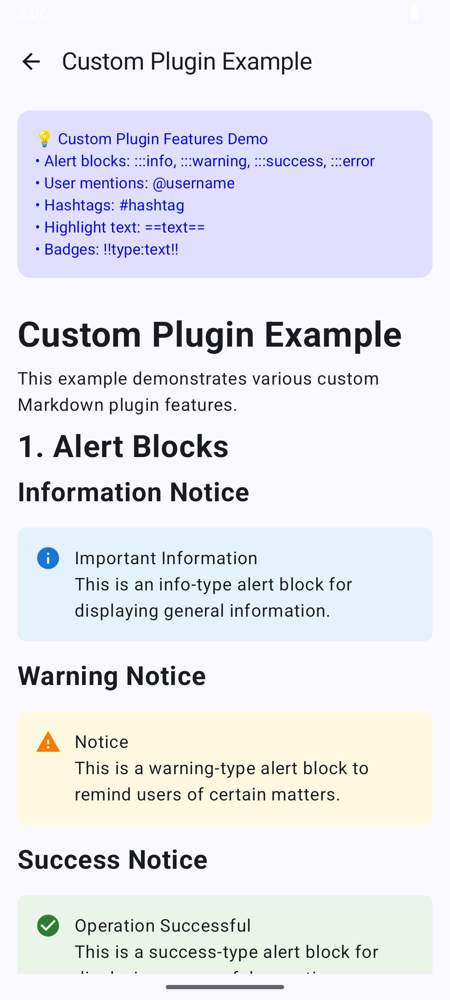

# Compose Markdown

[English](README.md) | [简体中文](README_zh-CN.md)

一个功能强大、可高度定制的 Jetpack Compose Markdown 渲染库，支持丰富的 Markdown 语法和自定义样式。

## 目录

- [特性](#-特性)
- [技术栈](#-技术栈)
- [安装](#-安装)
- [快速开始](#-快速开始)
- [核心组件](#-核心组件)
- [样式定制](#-样式定制)
- [高级特性](#-高级特性)
- [插件](#-插件)
- [API 概览](#-api-概览)
- [常见问题](#-常见问题)
- [贡献指南](#-贡献指南)
- [许可证](#-许可证)

## 📋 特性

### 📸 示例截图

| 自定义样式 | 表格与代码块 |             自定义插件（警告框）             |
| :---: | :---: |:-----------------------------------------------:|
| *自定义排版样式* | *复杂表格与代码高亮* |                 *自定义区块*                  |
|  |  |  |

### 核心特性

- ✅ **标准 Markdown 支持** - 完整支持 CommonMark 规范
- ✅ **扩展语法** - 支持 GFM（GitHub Flavored Markdown）表格
- ✅ **代码语法高亮** - 支持多语言代码块语法高亮
- ✅ **多媒体支持** - 渲染图片、链接和其他多媒体内容
- ✅ **自适应设计** - 完美适配不同尺寸屏幕

### 性能与扩展

- ⚡ **异步解析** - 后台线程解析，确保 UI 流畅
- 🎨 **高度可定制** - 支持自定义样式、渲染器和解析器
- 🔌 **插件系统** - 灵活的插件架构，轻松扩展功能
- 🛡️ **错误处理** - 优雅的错误状态处理机制

## 🔧 技术栈

| 技术                  | 版本        | 作用                     |
|-----------------------|-------------|--------------------------|
| **Jetpack Compose**   | 2024.09.00+ | 现代 UI 框架             |
| **Flexmark**          | 0.64.8      | Markdown 解析引擎        |
| **Kotlin Coroutines** | 1.7+        | 异步处理                 |
| **Material Design 3** | 最新        | 设计语言规范             |

## 📦 安装

### 系统要求

- **Android API**：24+（Android 7.0）
- **Kotlin**：2.0.21+
- **Compose BOM**：2024.09.00+
- **Java**：8+

### 添加依赖

1. 在项目中添加 `jitpack.io` 仓库：

```kotlin
repositories {
	...
	maven(url = "https://jitpack.io")
}
```

2. 在项目的 `build.gradle.kts` 中添加依赖：在 `./gradle/libs.versions.toml` 中定义库：

```toml
[versions]
compose-markdown = "0.0.1"
composeBom = "2024.09.00"
coil = "2.5.0"
[libraries]
androidx-compose-bom = { group = "androidx.compose", name = "compose-bom", version.ref = "composeBom" }
coil-compose = { group = "io.coil-kt", name = "coil-compose", version.ref = "coil" }
compose-markdown = { group = "com.github.feiyin0719", name = "ComposeMarkdown", version.ref = "compose-markdown" }
```

然后在模块 `build.gradle.kts` 中添加依赖：

```kotlin
dependencies {
	implementation(libs.androidx.core.ktx)
	implementation(platform(libs.androidx.compose.bom))
	implementation(libs.androidx.ui)
	implementation(libs.androidx.ui.graphics)
	implementation(libs.androidx.ui.tooling.preview)
	implementation(libs.androidx.material3)
	implementation(libs.coil.compose)
	implementation(libs.compose.markdown)
}
```

## 🚀 快速开始

### 基础用法

最简单的使用方式：

```kotlin
import com.iffly.compose.markdown.MarkdownView
import com.iffly.compose.markdown.config.MarkdownRenderConfig

@Composable
fun SimpleMarkdownExample() {
	val markdownContent = """
		# Welcome to Compose Markdown
        
		This is a powerful Markdown rendering library.
        
		## Supported Features
        
		- **Bold text**
		- *Italic text*
		- `Inline code`
		- [Link](https://github.com)
        
		### Code Block Example
        
		```kotlin
		@Composable
		fun HelloWorld() {
			Text("Hello, Compose Markdown!")
		}
		```
	""".trimIndent()

	val config = remember { MarkdownRenderConfig.Builder().build() }

	MarkdownView(
		content = markdownContent,
		markdownRenderConfig = config,
		modifier = Modifier.fillMaxSize(),
	)
}
```

### 配置化使用（MarkdownTheme）

```kotlin
import com.iffly.compose.markdown.style.MarkdownTheme

@Composable
fun ConfiguredMarkdownExample() {
	val markdownTheme =
		MarkdownTheme(
			textStyle =
				TextStyle(
					fontSize = 16.sp,
					lineHeight = 24.sp,
				),
			headStyle =
				mapOf(
					1 to TextStyle(fontSize = 28.sp, fontWeight = FontWeight.Bold),
					2 to TextStyle(fontSize = 24.sp, fontWeight = FontWeight.Bold),
				),
		)

	val config =
		remember {
			MarkdownRenderConfig.Builder()
				.markdownTheme(markdownTheme)
				.build()
		}

	MarkdownView(
		content = "# Custom Style Title\n\nThis is Markdown content with custom styling.",
		markdownRenderConfig = config,
		modifier = Modifier.fillMaxSize(),
		showNotSupportedText = true,
		actionHandler = ActionHandler { action ->
			// 处理行为（链接、图片等）
		},
		onError = { error ->
			Text(
				text = "Content parsing failed: ${error.message}",
				color = MaterialTheme.colorScheme.error,
			)
		},
	)
}
```

### MarkdownRenderConfig（概览）

Markdown 渲染的高层配置，通过以下方式创建：

```kotlin
val config = MarkdownRenderConfig.Builder()
	.markdownTheme(MarkdownTheme())
	// .addPlugin(...)
	// .addBlockRenderer(...)
	// .addInlineNodeStringBuilder(...)
	.build()
```

完整配置 API 参见 [docs/API.md](docs/API.md)。

## 🎨 样式定制（MarkdownTheme）

`MarkdownTheme` 用于描述 Markdown 内容的排版、颜色和组件样式。

### 基础样式配置

```kotlin
val markdownTheme =
	MarkdownTheme(
		textStyle =
			TextStyle(
				fontSize = 16.sp,
				lineHeight = 24.sp,
				fontFamily = FontFamily.Default,
			),
		strongEmphasis =
			SpanStyle(
				fontWeight = FontWeight.Bold,
				color = MaterialTheme.colorScheme.primary,
			),
		emphasis =
			SpanStyle(
				fontStyle = FontStyle.Italic,
				color = MaterialTheme.colorScheme.onSurface.copy(alpha = 0.8f),
			),
		code =
			TextStyle(
				fontFamily = FontFamily.Monospace,
				fontSize = 14.sp,
				color = MaterialTheme.colorScheme.secondary,
				background = MaterialTheme.colorScheme.surfaceVariant,
			),
		link =
			TextLinkStyles(
				style =
					SpanStyle(
						/* Lines 246-248 omitted */
					),
				hoveredStyle =
					SpanStyle(
						/* Lines 251-256 omitted */
					),
				pressedStyle =
					SpanStyle(
						/* Lines 259-264 omitted */
					),
			),
	)
```

### 标题样式定制

```kotlin
val markdownTheme =
	MarkdownTheme(
		headStyle =
			mapOf(
				MarkdownTheme.HEAD1 to
					TextStyle(
						/* Lines 278-281 omitted */
					),
				MarkdownTheme.HEAD2 to
					TextStyle(
						/* Lines 284-287 omitted */
					),
				MarkdownTheme.HEAD3 to
					TextStyle(
						/* Lines 290-293 omitted */
					),
			),
	)
```

你可以将该主题传入 `MarkdownRenderConfig.Builder().markdownTheme(markdownTheme)`。

## 🔧 高级特性

### MarkdownView 使用模式（更新后的 API）

MarkdownView 提供多种使用模式以适配不同场景。

#### 1. 同步解析版本（即时解析）

适合内容较小、可以立即完成解析而不会阻塞 UI 的场景。

```kotlin
@Composable
fun MarkdownView(
	content: String,
	markdownRenderConfig: MarkdownRenderConfig,
	modifier: Modifier = Modifier,
	showNotSupportedText: Boolean = false,
	actionHandler: ActionHandler? = null,
	onError: (@Composable (Throwable) -> Unit)? = null,
)
```

**使用示例：**

```kotlin
@Composable
fun SyncMarkdownExample() {
	val shortContent = """
		# Quick Notes
		This is short markdown content that can be parsed instantly.
		- Item 1
		- Item 2
        
		**Bold text** and *italic text*
	""".trimIndent()

	val config = remember { MarkdownRenderConfig.Builder().build() }

	MarkdownView(
		content = shortContent,
		markdownRenderConfig = config,
		modifier = Modifier.padding(16.dp),
		showNotSupportedText = true,
		actionHandler = ActionHandler { action ->
			// Handle actions
		},
		onError = { error ->
			Text(
				text = "Parsing failed: ${error.message}",
				color = MaterialTheme.colorScheme.error,
			)
		},
	)
}
```

#### 2. 异步解析版本（后台解析）

推荐用于内容较大或需要展示加载 / 错误状态的场景。

```kotlin
@Composable
fun MarkdownView(
	content: String,
	markdownRenderConfig: MarkdownRenderConfig,
	modifier: Modifier = Modifier,
	showNotSupportedText: Boolean = false,
	actionHandler: ActionHandler? = null,
	parseDispatcher: CoroutineDispatcher? = null,
	onLoading: (@Composable () -> Unit)? = null,
	onError: (@Composable (Throwable) -> Unit)? = null,
)
```

**使用示例：**

```kotlin
@Composable
fun AsyncMarkdownExample() {
	val largeContent = """
		# Large Document
		This is a large markdown document that may take time to parse.
        
		## Features
        
		${generateLargeMarkdownContent()}
	""".trimIndent()

	val config = remember { MarkdownRenderConfig.Builder().build() }

	MarkdownView(
		content = largeContent,
		markdownRenderConfig = config,
		modifier = Modifier.fillMaxSize(),
		showNotSupportedText = true,
		actionHandler = ActionHandler { action ->
			// Handle actions such as links, images, etc.
		},
		parseDispatcher = Dispatchers.IO,
		onLoading = {
			Box(
				modifier = Modifier.fillMaxSize(),
				contentAlignment = Alignment.Center,
			) {
				Column(
					horizontalAlignment = Alignment.CenterHorizontally,
				) {
					CircularProgressIndicator()
					/* Lines 408-412 omitted */
					)
				}
			}
		},
		onError = { error ->
			Card(
				modifier = Modifier
			) {
				Column(
					/* Lines 427-450 omitted */
				)
			}
		},
	)
}
```

#### 3. 预解析 Node 版本

适用于已经有解析后的 Node 的场景。

```kotlin
@Composable
fun MarkdownView(
	node: Node,
	markdownRenderConfig: MarkdownRenderConfig,
	modifier: Modifier = Modifier,
	showNotSupportedText: Boolean = false,
	actionHandler: ActionHandler? = null,
)
```

**使用示例：**

```kotlin
@Composable
fun PreParsedMarkdownExample() {
	val config = remember { MarkdownRenderConfig.Builder().build() }
	val parser = remember(config) { config.parser }
	val preParseNode = remember {
		parser.parse("# Pre-parsed Content\n\nThis content was parsed outside the composable.")
	}

	MarkdownView(
		node = preParseNode,
		markdownRenderConfig = config,
		modifier = Modifier.padding(16.dp),
		showNotSupportedText = true,
		actionHandler = ActionHandler { action ->
			// Handle actions
		},
	)
}
```

#### 4. 懒加载版本（LazyMarkdownView）

当处理非常大的 Markdown 文件（多 MB、超过 1 万行、包含大量图片 / 长代码块）时，使用 `LazyMarkdownView`。

```kotlin
@Composable
fun LazyMarkdownView(
	file: File,
	markdownRenderConfig: MarkdownRenderConfig,
	modifier: Modifier = Modifier,
	showNotSupportedText: Boolean = false,
	actionHandler: ActionHandler? = null,
	chunkLoaderConfig: ChunkLoaderConfig = ChunkLoaderConfig(parserDispatcher = MarkdownThreadPool.dispatcher),
	nestedPrefetchItemCount: Int = 3,
)
```

基础示例：

```kotlin
@Composable
fun LargeMarkdownDocument() {
	val markdownFile = File("/path/to/large-document.md")
	val config = remember { MarkdownRenderConfig.Builder().build() }

	LazyMarkdownView(
		file = markdownFile,
		markdownRenderConfig = config,
		modifier = Modifier.fillMaxSize(),
		chunkLoaderConfig =
			ChunkLoaderConfig(
				/* initialLines = 1000,
				/* Lines 527-529 omitted */
				parserDispatcher = MarkdownThreadPool.dispatcher,
			),
	)
}
```

最简使用（使用默认配置）：

```kotlin
LazyMarkdownView(
	file = File(path),
	markdownRenderConfig = MarkdownRenderConfig.Builder().build(),
)
```

> 关于 `ChunkLoaderConfig` 的详细配置，请查看源码与 [docs/API.md](docs/API.md)。

### 自定义区块渲染器（`IBlockRenderer`）

你可以为任意 Flexmark 的 `Block` 类型提供自定义渲染器。

```kotlin
class AlertBlockRenderer : IBlockRenderer<AlertBlock> {
	@Composable
	override fun Invoke(
		node: AlertBlock,
		modifier: Modifier,
	) {
		Card(modifier = modifier) {
			Text(text = node.title)
		}
	}
}

val config =
	MarkdownRenderConfig
		.Builder()
		.addBlockRenderer(AlertBlock::class.java, AlertBlockRenderer())
		.build()
```

然后将 `config` 传入 `MarkdownView` 即可。

### 自定义行内构建器（`IInlineNodeStringBuilder`）

使用 `IInlineNodeStringBuilder` 将自定义行内节点转换为带样式的文本。

```kotlin
class MentionInlineBuilder : IInlineNodeStringBuilder<MentionNode> {
	override fun AnnotatedString.Builder.buildInlineNodeString(
		node: MentionNode,
		inlineContentMap: MutableMap<String, MarkdownInlineView>,
		markdownTheme: MarkdownTheme,
		actionHandler: ActionHandler?,
		indentLevel: Int,
		isShowNotSupported: Boolean,
		renderRegistry: RenderRegistry,
		measureContext: TextMeasureContext,
	) {
		pushStyle(markdownTheme.linkTextStyle)
		append("@" + node.username)
		pop()
	}
}

val config =
	MarkdownRenderConfig
		.Builder()
		.addInlineNodeStringBuilder(MentionNode::class.java, MentionInlineBuilder())
		.build()
```
  
## 🔌 插件

当前支持的官方插件模块：

| 插件 | 模块（artifact） | 描述 |
|--------|-------------------|-------------|
| 任务列表 | markdown-task | 支持 GitHub 风格的任务列表复选框：`- [ ]` / `- [x]` |
| LaTeX / 数学公式 | markdown-latex | 支持行内和块级公式：`$...$`、`$$...$$` |

### 依赖声明（如果以独立 artifact 形式发布）

```kotlin
dependencies {
	implementation("com.github.feiyin0719:markdown-task:<version>")
	implementation("com.github.feiyin0719:markdown-latex:<version>")
}
```

如果只发布了根库（例如 `ComposeMarkdown`），这些模块可能已经被打包在其中，此时你可以直接导入相关类使用。

### 任务列表示例

```kotlin
val config = MarkdownRenderConfig.Builder()
	.addPlugin(
		TaskMarkdownRenderPlugin(
			taskStyle = SpanStyle(/* customize color / weight etc. */)
		)
	)
	.build()
```

Markdown 示例：

```
- [ ] Unfinished item
- [x] Completed item
```

### LaTeX / 数学公式示例

```kotlin
val mathConfig = MarkdownRenderConfig.Builder()
	.addPlugin(
		MarkdownMathPlugin(
			mathStyle = SpanStyle(fontStyle = FontStyle.Italic),
			width = 200.sp,
			height = 80.sp,
			align = TextAlign.Center,
			enableGitLabExtension = false
		)
	)
	.build()
```

支持：

- 行内公式：`$E = mc^2$`
- 多行块级公式：

  ```
  $$
  E = mc^2
  $$
  ```

- 单行块级公式：`$$ E = mc^2 $$`

### 同时启用多个插件

```kotlin
val fullConfig = MarkdownRenderConfig.Builder()
	.addPlugin(TaskMarkdownRenderPlugin())
	.addPlugin(
		MarkdownMathPlugin(
			mathStyle = SpanStyle(fontStyle = FontStyle.Italic),
			width = 180.sp,
			height = 72.sp,
			align = TextAlign.Center
		)
	)
	.build()
```

### 自定义插件回顾

实现 `IMarkdownRenderPlugin`（或继承 `AbstractMarkdownRenderPlugin`），并通过 `addPlugin()` 注册。一个典型插件可以：

- 添加 Flexmark 扩展（重写 `extensions()`）
- 提供自定义区块 / 行内解析器
- 注册自定义区块渲染器 / 行内节点字符串构建器

> 完整示例可参考前文的“创建自定义插件”章节。

## 📚 API 概览

本节给出主要 API 的高层概览。关于完整函数签名和详细参数说明，请参考专门的 API 文档：

- **完整 API 参考**：[docs/API.md](docs/API.md)

## Future Plans

~~- 🚀 Support load large markdown file and render progressively
Load and render visible blocks to improve performance and memory usage~~  -- Completed in v0.0.4

- Support markdown inline editing mode(inline edit is edit markdown and render at the same time) -- Planned for v0.1.0

- Supports jump-to-section functionality via clickable TOC.

- 🚀 Add more built-in plugins for common use cases

## ❓ 常见问题（FAQ）

### Q: 如何处理大型 Markdown 文档的性能问题？

A: 本库使用异步解析机制，在后台线程中进行 Markdown 解析，不会阻塞 UI 线程。对于非常大的文档，推荐使用分页或懒加载的方式。

### Q: 当前支持哪些 Markdown 扩展语法？

A: 当前支持 CommonMark 标准语法和 GFM 表格。未来会逐步增加更多扩展语法支持。

### Q: 如何自定义代码块的语法高亮？

A: 你可以通过实现自定义的 `CodeBlockRenderer` 并集成三方语法高亮库来实现自定义高亮效果。

## 🤝 贡献指南

欢迎贡献代码！开始之前：

1. Fork 本仓库
2. 创建特性分支：`git checkout -b feat/my-feature`
3. 完成你的修改（请尽量保持修改范围聚焦；在可能的情况下补充测试）
4. 本地运行检查（示例）：
   - `./gradlew build` – 编译并运行测试
   - `./gradlew lintKotlin detekt`（如果已配置）
5. 使用约定前缀提交：
   - `feat:` 新特性
   - `fix:` Bug 修复
   - `docs:` 文档修改
   - `refactor:` 重构（不改变行为）
   - `perf:` 性能优化
   - `test:` 添加 / 改进测试
   - `build:` 构建系统 / 依赖变更
   - `chore:` 其他维护性工作
6. 提交 Pull Request，并在描述中说明：
   - 做了什么 & 原因
   - 截图（UI 变更）/ 性能对比（性能优化）
   - 关联的 Issue ID（如 `Closes #12`）

代码风格与规范：

- 更倾向于小而可组合的函数
- 避免过早优化——先度量再优化
- 保持公共 API 具备 KDoc 文档
- 使用简洁且有意义的提交信息

问题反馈：

- 请提供复现步骤
- 附上可最小化的 Markdown 示例内容，便于触发问题
- 提供设备 / 模拟器 API 级别和库版本信息

## 📄 许可证

本项目基于 MIT License 开源发布。

```
MIT License

Copyright (c) 2025 Compose Markdown Authors

Permission is hereby granted, free of charge, to any person obtaining a copy
of this software and associated documentation files (the "Software"), to deal
in the Software without restriction, including without limitation the rights
to use, copy, modify, merge, publish, distribute, sublicense, and/or sell
copies of the Software, and to permit persons to whom the Software is
furnished to do so, subject to the following conditions:

The above copyright notice and this permission notice shall be included in all
copies or substantial portions of the Software.

THE SOFTWARE IS PROVIDED "AS IS", WITHOUT WARRANTY OF ANY KIND, EXPRESS OR
IMPLIED, INCLUDING BUT NOT LIMITED TO THE WARRANTIES OF MERCHANTABILITY,
FITNESS FOR A PARTICULAR PURPOSE AND NONINFRINGEMENT. IN NO EVENT SHALL THE
AUTHORS OR COPYRIGHT HOLDERS BE LIABLE FOR ANY CLAIM, DAMAGES OR OTHER
LIABILITY, WHETHER IN AN ACTION OF CONTRACT, TORT OR OTHERWISE, ARISING FROM,
OUT OF OR IN CONNECTION WITH THE SOFTWARE OR THE USE OR OTHER DEALINGS IN THE
SOFTWARE.
```

---

<div align="center">

**[⬆ 回到顶部](#compose-markdown)**

由 Compose Markdown 团队用 ❤️ 打造

</div>
