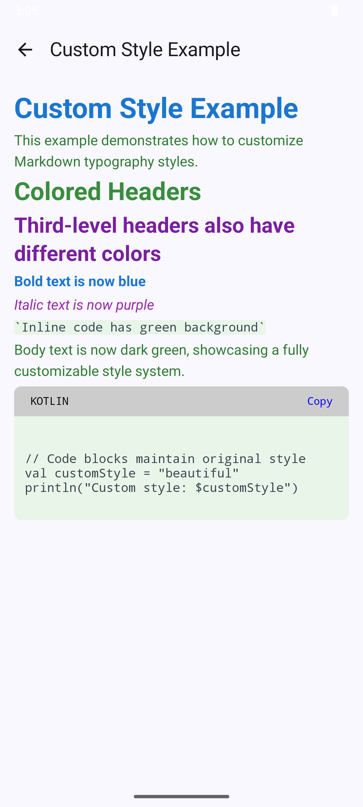
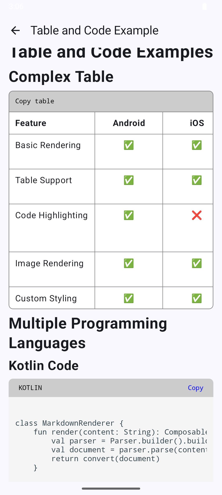
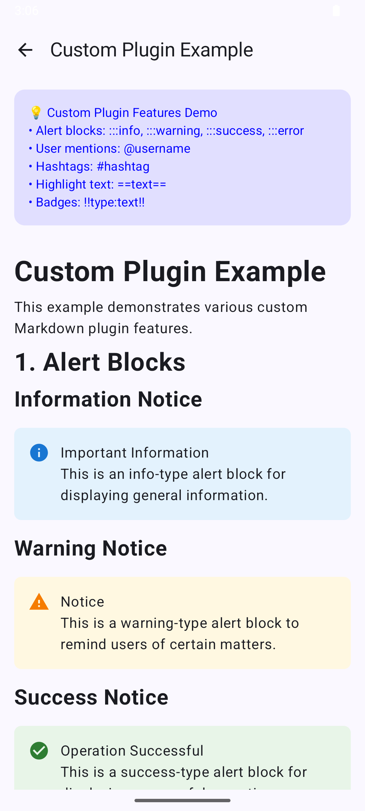

# 🚀 Compose Markdown: Breathe New Life into Markdown in Jetpack Compose!

🏠 [Project Home](https://github.com/feiyin0719/ComposeMarkdown)

> In the world of mobile development, Markdown rendering has always been a headache. Traditional WebView is bulky and slow, while native implementation is complex and tedious. But now, everything is different! 🎉

## 📸 Sample Screenshots

| Custom Styles | Tables and Code Blocks |         Custom Plugins (Alerts)          |
| :---: | :---: |:----------------------------------------:|
| *Custom typography styles* | *Complex tables and code highlighting* |              *Custom Block*              |
|  |  |  |

## ✨ Why Choose Compose Compose Markdown?

Imagine you're developing a tech blog app that needs to display complex Markdown content. Traditional solutions force you to make difficult choices between performance and functionality, but **Compose Markdown** makes it effortless!

### 🎯 Three Core Advantages

#### 1. 🎨 **Ultimate Customization** - Your Style, Your Choice

##### 🎨**Comprehensive Style Control** - Create Unique Visual Experiences

```kotlin
val customStyle = TypographyStyle(
    strongEmphasis = SpanStyle(
        fontWeight = FontWeight.Bold,
        color = Color(0xFF2196F3)  // Blue bold text makes highlights more prominent
    ),
    code = TextStyle(
        fontFamily = FontFamily.Monospace,
        fontSize = 14.sp,
        color = Color(0xFF37474F),
        background = Color(0xFFF5F5F5)  // Elegant code block styling
    ),
    // More styles waiting for you to explore...
)
```

Unlike those "one-size-fits-all" solutions, Compose Markdown gives you **complete style control**. From font colors to spacing layouts, from link styles to code highlighting, every detail can be customized to your liking!

##### 🔧 **Custom Node Recognition and Rendering** - Unlimited Extensions

More powerfully, you can create **completely custom renderers** for any Markdown syntax elements:

```kotlin
// Custom alert box renderer
class AlertRenderer : IBlockRenderer<CustomAlertBlock> {
    @Composable
    override fun Invoke(node: CustomAlertBlock, modifier: Modifier) {
        Card(
            modifier = modifier.fillMaxWidth(),
            colors = CardDefaults.cardColors(
                containerColor = when(node.type) {
                    "warning" -> Color(0xFFFFF3CD)
                    "error" -> Color(0xFFF8D7DA)
                    else -> Color(0xFFD1ECF1)
                }
            )
        ) {
            Row(modifier = Modifier.padding(16.dp)) {
                Icon(
                    imageVector = when(node.type) {
                        "warning" -> Icons.Filled.Warning
                        "error" -> Icons.Filled.Error
                        else -> Icons.Filled.Info
                    },
                    contentDescription = null
                )
                Spacer(modifier = Modifier.width(8.dp))
                Text(text = node.content)
            }
        }
    }
}

// Register custom renderer
val config = MarkdownRenderConfig.Builder()
    .addBlockRenderer(
        CustomAlertBlock::class.java, 
        AlertRenderer()
    )
    .build()
```

This means you can:
- 🎯 **Recognize Custom Syntax**: Like `:::warning` alert blocks
- 🎨 **Create Exclusive UI**: Render with Material Design 3 components
- 🔌 **Seamless Integration**: Perfect coexistence with existing Markdown syntax
- 📱 **Native Experience**: Fully Compose-styled, not HTML rendering

#### 2. ⚡ **Excellent Performance** - Lightning-fast Rendering Speed

##### ⚡ **Asynchronous Parsing**: Using coroutines and thread pools to keep UI thread unblocked

Traditional Markdown renderers either cause stuttering with synchronous parsing or have complex logic with asynchronous processing. Compose Markdown cleverly provides **dual options**:

```kotlin
// Small document? Synchronous rendering, ready to use!
MarkdownView(
    content = shortMarkdown,
    markdownRenderConfig = config
)

// Large document? Asynchronous processing, perfect user experience!
MarkdownView(
    content = longMarkdown,
    markdownRenderConfig = config,
    parseDispatcher = MarkdownThreadPool.dispatcher,
    onLoading = { CircularProgressIndicator() }
)
```

This intelligent design lets you choose the most appropriate rendering strategy based on content size - small documents open instantly, large documents don't stutter!

##### 🚀 **LazyMarkdownView** - The Ultimate Weapon for Large Documents

For **massive Markdown files** (like dozens of MB of technical documentation), we provide a revolutionary chunked lazy loading solution:

```kotlin
LazyMarkdownView(
    file = File("huge_documentation.md"),  // 50MB technical documentation
    markdownRenderConfig = config,
    chunkLoaderConfig = ChunkLoaderConfig(
        initialLineCount = 1000,
        incrementalLineCount = 500,
        minNodesAhead = 100,
        minNodesBehind = 30,
        maxCachedNodes = 500,
        maxCachedSourceLines = 10_000,
        parserDispatcher = MarkdownThreadPool.dispatcher,
    ),
    nestedPrefetchItemCount = 5  // Precompose 5 Compose items
)
```

**The Magic of Chunked Loading**:
- 📊 **Smart Chunking**: Split large files into small chunks, parsed on demand
- 👀 **Viewport Optimization**: Only render content visible to users
- 🔮 **Predictive Loading**: Smart preloading based on scroll direction
- 💾 **Memory Friendly**: No more OOM worries, regardless of file size
- ⚡ **Smooth Scrolling**: Built-in prefetch strategy, scrolling smooth as silk

This design lets you easily handle **arbitrarily large** Markdown files, from KB-sized READMEs to hundreds of MB complete project documentation!

#### 3. 🏗️ **Modern Architecture** - 100% Jetpack Compose

Say goodbye to the pain of hybrid development! Compose Markdown is pure Compose implementation from start to finish:
- 🎭 **State Management**: Smart caching using `remember` and `mutableStateOf`
- 🔄 **Asynchronous Processing**: `LaunchedEffect` with coroutines, smooth as silk
- 🧩 **Modular Design**: Each component is an independent Composable, highly reusable

## 🛠️ Simple Getting Started, Immediate Experience

### Basic Usage - Done in 3 Lines of Code

```kotlin
@Composable
fun MyMarkdownScreen() {
    val markdownContent = """
        # Welcome to Compose Markdown! 🎉
        
        This is an **awesome** Markdown rendering library:
        
        - ✅ Supports standard syntax
        - 🎨 Fully customizable
        - ⚡ Excellent performance
        
        ```kotlin
        // Code highlighting is also beautiful!
        fun hello() = println("Hello Compose!")
        ```
        
        | Feature | Support |
        |---------|---------|
        | Tables  | ✅ Perfect |
        | Images  | ✅ Perfect |
        | Links   | ✅ Perfect |
    """
    
    MarkdownView(
        content = markdownContent,
        markdownRenderConfig = MarkdownRenderConfig.Builder().build()
    )
}
```

That's how simple it is! Three lines of code, and you have a fully functional Markdown renderer!

### Advanced Customization - Create Your Own Style

```kotlin
@Composable
fun CustomStyledMarkdown() {
    val config = MarkdownRenderConfig.Builder()
        .theme(
            TypographyStyle(
                // Custom paragraph spacing
                spaceHeight = 12.dp,
                // Cool divider lines
                breakLineColor = Color(0xFF6200EA),
            
            )
        )
        .build()
    
    MarkdownView(
        content = yourMarkdown,
        markdownRenderConfig = config,
        linkInteractionListener = { url ->
            // Custom link click handling
            openInBrowser(url)
        }
    )
}
```

### Lazy Loading Lists - Handle Massive Content

For lists containing large amounts of Markdown content, we also thoughtfully provide `LazyMarkdownView`:

```kotlin
 LazyMarkdownView(
                file = file,
                markdownRenderConfig = config,
                modifier = Modifier
                    .fillMaxSize()
                    .padding(16.dp)
            )
  ```

## 🔥 Real-world Scenarios

### 📱 Tech Blog Applications
Imagine you're developing a tech sharing app like Juejin, Compose Markdown lets you easily implement:
- 📝 Perfect rendering of article content
- 🎨 Seamless adaptation of theme switching
- 🔗 Smart navigation of internal links

### 📚 Note Management Tools
Building the next generation note-taking app? Compose Markdown provides:
- ⚡ Real-time preview functionality
- 🏷️ Custom tag styling
- 📊 Native support for tables and charts

### 💬 Chat Applications
Supporting Markdown in chat apps? Piece of cake:
- 💬 Formatted text within message bubbles
- 📋 Syntax highlighting for code snippets
- 🔗 Automatic recognition and rendering of links

## 🌟 Architectural Highlights

### Plugin-based Design
```kotlin
// Need task list functionality? Easy extension!
val configWithTasks = MarkdownRenderConfig.Builder()
    .addRenderPlugin(TaskMarkdownRenderPlugin())  // Support for - [ ] task lists
    .build()
```

Clear state definitions make error handling elegant and reliable.

## 🎯 Performance Optimization Black Technology

1. **Smart Parsing Strategy**: Synchronous parsing for small content, asynchronous processing for large content
2. **Memory Optimization**: Using `remember` to avoid repeated parsing
3. **Thread Pool Management**: Dedicated `MarkdownThreadPool` ensures performance
4. **Lazy Loading Support**: Memory-friendly for large list scenarios
5. **Chunked Loading Rendering**: The ultimate tool for handling super large files

## 🚀 Future Prospects

Compose Markdown is not just a rendering library, but an **ecosystem**:

- 🔧 **Extensibility**: Plugin architecture supports custom syntax
- 🎨 **Theme System**: Perfect integration with Material Design 3
- 📊 **Data Visualization**: Future support for charts and mathematical formulas
- 🌐 **Multi-platform**: Compose Multiplatform adaptation on the way

## 💡 Conclusion

In the world of Jetpack Compose, Compose Markdown is not just a tool, but a **revolutionary breakthrough**. It proves that modern Android development can be both elegant and efficient, both powerful and simple.

Whether you're building the next hit app or improving the user experience of existing projects, Compose Markdown will be your most reliable partner.

**Start your Compose Markdown journey now! Let every line of Markdown shine with the brilliance of Compose!** ✨

---

*Made with ❤️ by Compose enthusiasts, for the Android community.*

## 📖 Quick Links
- 🏠 [Project Home](https://github.com/feiyin0719/ComposeMarkdown)
